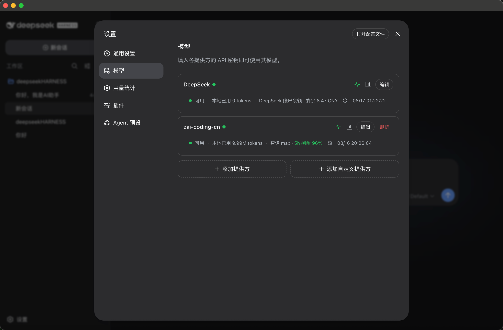

# DSH 模型 API 守护

简体中文 | [English](README.md)

`dsh-llm-guardian` 是面向 DeepSeek Harness 的社区插件。它在“设置 → 模型”的 Provider 卡片中加入连通检测、本地 Token 额度以及账户余额或套餐用量查询，同时不会把 API 密钥写入插件设置。

## Provider 卡片

插件会为每个已配置的 Provider 添加连通检测按钮、模型用量入口和紧凑状态摘要。



## 功能

- 定时及手动 Provider 连通检测。
- 本地 Token 计数，并可在超过额度后拦截新请求。
- 按 Provider 查询账户余额或套餐用量，支持超时与自动刷新设置。
- 内置 DeepSeek 余额和智谱 Coding Plan 额度查询适配。
- 自定义查询具备密钥脱敏、响应大小限制和同源限制。

## 从 GitHub 安装

```sh
dsh plugin add github:ice-kele/dsh-llm-guardian
```

安装后重启 DeepSeek Harness 或 DSH Desktop，即可在“设置 → 模型”看到新增入口。

## 兼容性

插件优先使用类型化的 `settings.models.provider.action` 与 `settings.models.provider.summary` 扩展位。当前 DSH 正式版本尚未提供这两个扩展位，因此插件暂时保留 DOM 兼容适配；对应的上游扩展位补丁会单独整理，待官方接口可用后即可移除兼容层。

## 隐私与联网行为

- API 密钥通过 DSH credentials 服务解析，插件不会持久化密钥。
- 连通检测访问当前 Provider 配置的模型发现端点。
- 用量查询仅允许访问 Provider 同源 HTTPS 地址；本机 Provider 可使用回环 HTTP。
- 本地计数和查询结果存放在 `llm-guardian` 设置命名空间。

## 开发检查

```sh
npm install
npm run check
npm pack --dry-run
```

## 许可证

[MIT](LICENSE)
